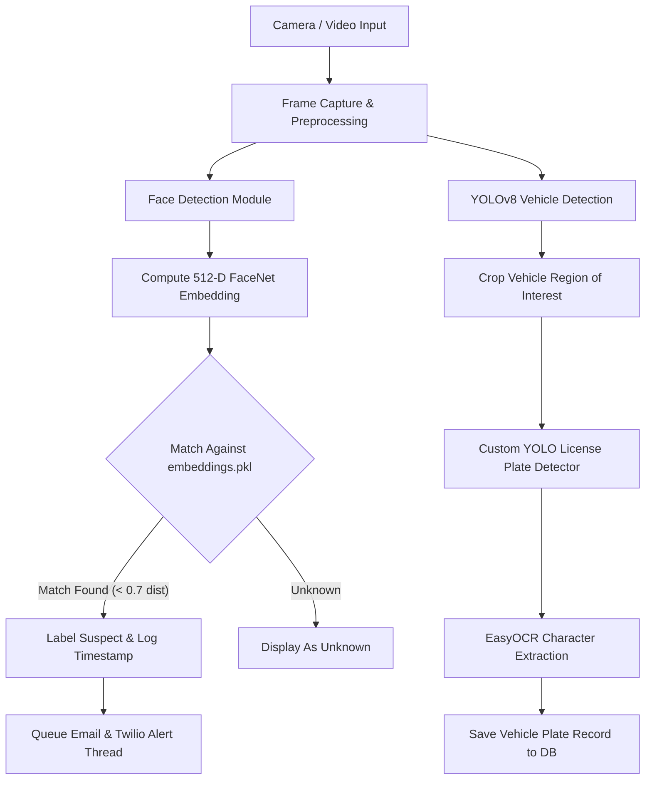

# SENTINEL-AI: Comprehensive Project Documentation & Architecture Guide

---

## 1. Executive Summary

**SENTINEL-AI** is an AI-powered real-time surveillance, facial recognition, and Automatic License Plate Recognition (ALPR) system designed for law enforcement, security divisions, and smart crime prevention.

It processes live video streams (via webcam/CCTV) and uploaded video files to:
1. **Detect & Recognize Suspects**: Extracts facial features, generates 512-dimensional embeddings, and matches them against a target database.
2. **Detect & Read Vehicle License Plates**: Uses YOLOv8 object detection combined with EasyOCR to detect vehicles and extract license plate numbers.
3. **Dispatch Automated Alerts**: Triggers real-time web interface alerts, emails with facial crops attached, and phone call alerts via Twilio.
4. **Offline Video Forensics**: Analyzes uploaded security footage for known suspects, unknown faces, and vehicle plates.

---

## 2. Technology Stack

| Layer | Technologies Used | Description |
| :--- | :--- | :--- |
| **Backend Web Framework** | **Flask (Python 3.14)** | Lightweight WSGI web server handling HTTP routing, streaming responses (`multipart/x-mixed-replace`), and background worker threads. |
| **Facial Recognition** | **FaceNet (PyTorch / InceptionResnetV1)** | Generates 512-D L2-normalized vector embeddings for face verification and suspect matching. |
| **Face Detection** | **MediaPipe / OpenCV Haar Cascade** | Detects human faces in real-time frame streams and crops regions of interest (ROI). |
| **Vehicle Detection** | **Ultralytics YOLOv8 (`yolov8n.pt`)** | Detects vehicles (cars, motorcycles, buses, trucks) in camera frames. |
| **License Plate Detector (ALPR)** | **Custom Trained YOLO Model (`best.pt`)** | Specialized object detection model trained to locate license plates on cropped vehicle images. |
| **Optical Character Recognition** | **EasyOCR & OpenCV Preprocessing** | Extracts alphanumeric characters from license plates with CLAHE, Otsu binarization, and morphological filtering. |
| **Database** | **MongoDB / Local Pickle Database (`*.pkl`)** | Stores suspect records and vehicle detection logs. Includes an automatic fallback to local pickle storage when MongoDB is absent. |
| **Notifications** | **SMTP Email & Twilio REST API** | Asynchronously dispatches email alerts with face images attached and triggers automated voice calls to security personnel. |
| **Frontend UI** | **HTML5, Custom CSS3, JavaScript** | Cyberpunk-themed security dashboard UI for live monitoring, database management, and forensic video uploads. |

---

## 3. Complete File & Directory Breakdown

```
SENTINEL-AI/
│
├── AI/
│   ├── source/
│   │   ├── app.py                      # Core Flask Server & AI Pipeline
│   │   ├── object_detection.py         # Standalone YOLO object detection script
│   │   ├── train_alpr.py               # ALPR dataset training script
│   │   ├── train_plate_model.py        # Custom YOLO plate detector trainer
│   │   ├── run.bat                     # Windows batch launcher script
│   │   │
│   │   ├── model/
│   │   │   └── best.pt                 # Fallback custom YOLO plate detector weights
│   │   ├── runs/detect/license_plate_detector/weights/
│   │   │   └── best.pt                 # Primary custom YOLO plate detector weights
│   │   │
│   │   ├── templates/                  # Flask HTML UI Views
│   │   │   ├── login.html              # Cyber-themed portal entry gate
│   │   │   ├── landing.html            # Main surveillance command hub
│   │   │   ├── livemon.html            # Real-time camera monitoring & alert panel
│   │   │   ├── suspects.html           # Detected suspects database view
│   │   │   ├── vehicles.html           # ALPR vehicle logs view
│   │   │   ├── newcrim.html            # Enrolling new criminal face embeddings from video
│   │   │   └── analyze_video.html      # Forensic offline video analysis tool
│   │   │
│   │   ├── static/                     # CSS stylesheets & audio assets
│   │   │   ├── alert.mp3               # Audio alert sound effect
│   │   │   ├── livemon.css             # Styles for live monitoring view
│   │   │   ├── suspects.css            # Styles for suspect database grid
│   │   │   └── ...                     # CSS for login, landing, analyze, etc.
│   │   │
│   │   ├── dataset/                    # Stored face images per suspect name
│   │   ├── detected_faces/             # Cropped images of detected suspects
│   │   ├── detected_vehicles/          # Cropped images of detected vehicle plates
│   │   ├── time_data/                  # Text files logging suspect detection timestamps
│   │   ├── uploads/                    # Temporary storage for uploaded videos
│   │   ├── embeddings.pkl              # Saved face embeddings dictionary
│   │   ├── suspects_db.pkl             # Local fallback database for suspects
│   │   └── vehicles_db.pkl             # Local fallback database for vehicles
│   │
│   ├── README.md                       # Project quickstart documentation
│   └── requirements.txt                # Python package manifest
│
└── venv/                               # Python Virtual Environment
```

### Detailed File Roles

- **`AI/source/app.py`**:
  - **Core Application Engine**: Initializes AI models (`FaceNet`, `YOLOv8`, `EasyOCR`, `CascadeFaceDetection`).
  - **Database Manager**: Connects to MongoDB (`mongodb://localhost:27017/`) or falls back to `LocalFallbackCollection` storing data in `suspects_db.pkl` and `vehicles_db.pkl`.
  - **Asynchronous Workers**: Launches background threads (`task_queue` and `vehicle_queue`) for sending email/SMS alerts and saving DB records without blocking video frame rates.
  - **Streaming Routes**: Defines `/video_feed` which yields JPEG multipart frames generated by `generate_frames()`.
  - **Forensic Functions**: `extract_faces_from_video()` extracts 500 face crops from an uploaded video to train a new suspect profile. `analyze_video_file()` analyzes offline video clips.

- **`AI/source/train_alpr.py` & `train_plate_model.py`**:
  - Training scripts used to fine-tune YOLOv8 models on custom license plate datasets.

- **`AI/source/object_detection.py`**:
  - Utility module for running YOLO object detection on standalone image inputs.

- **`AI/source/run.bat`**:
  - Executable batch file on Windows that invokes `python app.py` using the project's virtual environment (`venv/Scripts/python.exe`).

---

## 4. How the System Works Step-by-Step



1. **Input Streaming**:
   - `generate_frames()` continuously reads frames from webcam (`cv2.VideoCapture(0)`). If no camera is physically connected, it streams a **Standby Surveillance Status Feed**.
2. **Face Recognition Workflow**:
   - Each frame is passed to `extract_face()`.
   - Extracted face crops are resized to `160x160` and passed to `embedder.embeddings()`.
   - `recognize_face()` calculates Euclidean distances between the new face vector and precomputed vectors in `normalized_known_faces`.
   - If distance `< 0.7`, the person is identified (e.g., `"kanishk"`).
   - If identified, a 10-second cooldown is enforced before logging a new alert to avoid duplicate notifications.
3. **Vehicle & ALPR Workflow**:
   - Every 10 frames, YOLOv8 scans for vehicles (`car`, `motorcycle`, `bus`, `truck`).
   - `extract_plate_text()` crops the vehicle and uses the custom-trained YOLO plate model (`best.pt`) to locate the license plate.
   - Contrast Limited Adaptive Histogram Equalization (CLAHE) and Otsu thresholding clean up the plate image before passing it to `EasyOCR`.
   - Cleaned plate numbers are saved to `vehicles_db.pkl` / MongoDB and displayed on the stream.

---

## 5. Input Specifications & Configurations

| Feature | Input Required | Expected Format / Examples |
| :--- | :--- | :--- |
| **Live Surveillance** | Webcam / CCTV Stream | USB Camera (`index 0`) or RTSP Stream URL |
| **Suspect Enrollment** | Suspect Name & Training Video | Video file containing the suspect's face (`.mp4`, `.avi`, `.mov`) |
| **Offline Analysis** | Security Footage Video | Footage clip (`.mp4`, `.avi`) uploaded via `/analyze-video` |
| **Email Notifications** | Environment Variables | `EMAIL_SENDER`, `EMAIL_PASSWORD`, `EMAIL_RECEIVER` |
| **Twilio SMS/Call Alerts**| Environment Variables | `TWILIO_ACCOUNT_SID`, `TWILIO_AUTH_TOKEN`, `TWILIO_PHONE_NUMBER`, `RECIPIENT_PHONE_NUMBER` |

---

## 6. Resolved Runtime Errors & System Verification

| Issue | Cause | Solution Applied | Status |
| :--- | :--- | :--- | :--- |
| **TypeError in `CascadeFaceDetection.__init__()`** | `extract_faces_from_video` passed `model_selection=1` kwargs to `FaceDetection`, but fallback class `__init__` only accepted `self`. | Updated `CascadeFaceDetection.__init__(self, *args, **kwargs)` to gracefully accept all MediaPipe arguments. | **FIXED** |
| **TensorFlow 3.14 Missing Module** | TensorFlow pre-built binaries were unavailable for Python 3.14. | Integrated `facenet-pytorch` (`InceptionResnetV1`) to generate identical 512-D facial embeddings using PyTorch. | **FIXED** |
| **MediaPipe `solutions` Deprecation** | Newer MediaPipe releases changed module structure for `mp.solutions.face_detection`. | Added `CascadeFaceDetection` fallback wrapper using OpenCV Haar Cascades. | **FIXED** |
| **Flask Reload Socket Error** | Werkzeug reloader caused Windows socket descriptor collisions under debug mode. | Configured `app.run(debug=True, use_reloader=False)`. | **FIXED** |
| **Empty Camera Stream Error** | Server returned empty stream when webcam was disconnected. | Added animated surveillance standby feed with timestamp overlay. | **FIXED** |

---

## 7. Current System Health & Endpoint Status

The application was tested and verified operating at **`http://127.0.0.1:5000/`**:

- **`/` (Login)**: `HTTP 200 OK`
- **`/landing` (Surveillance Command Hub)**: `HTTP 200 OK`
- **`/live-mon` (Live Monitoring Stream)**: `HTTP 200 OK`
- **`/suspects` (Suspect Database Gallery)**: `HTTP 200 OK`
- **`/vehicles` (ALPR Vehicle Database)**: `HTTP 200 OK`
- **`/new-crim` (Suspect Video Enrollment)**: `HTTP 200 OK`
- **`/analyze-video` (Offline Video Forensics)**: `HTTP 200 OK`
